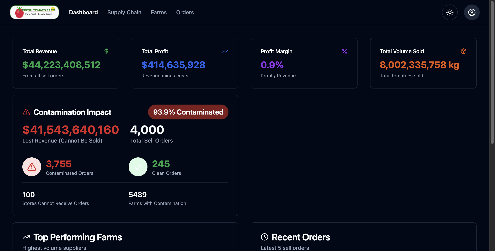
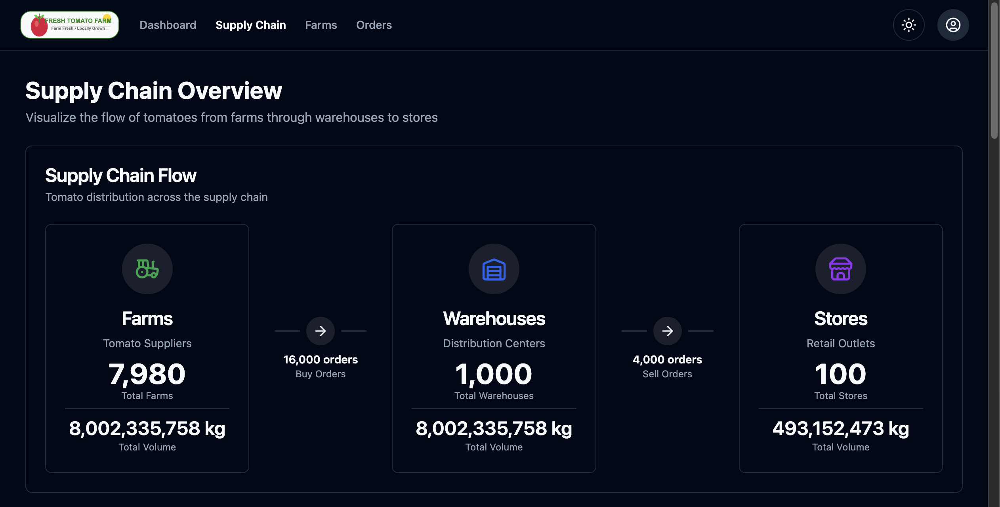

# FRESH Tomato Farm - Supply Chain Management App

A comprehensive supply chain management application for tomato distribution. Built with React, TypeScript, Shadcn UI, and Tailwind CSS.

## 📸 Screenshots

### Dashboard



### Supply Chain Visualization



## 🎯 Project Overview

Georgie is a manager of a tomato distributor. Her company buys tomatoes from **farms** and sells them to **stores**. However, sometimes farms become **contaminated**, and tomatoes from those farms can no longer be sold.

This app helps Georgie:

- **Track revenue and profits** from all transactions
- **Monitor contamination** across the supply chain
- **Visualize the supply chain flow** from farms through warehouses to stores
- **Manage farms** and identify high-risk suppliers
- **Analyze orders** with sorting, filtering, and pagination

## ✨ Features Implemented

### 📊 Dashboard

- **Key Metrics Cards**: Total Revenue, Profit, Profit Margin, Volume Sold
- **Contamination Impact Widget**: Shows lost revenue, affected orders, and contamination rate
- **Revenue & Profit Trends**: 30-day line chart showing financial performance
- **Contamination Trends**: 14-day bar chart showing clean vs contaminated orders
- **Top Performing Farms**: Ranked list of farms by volume
- **Recent Orders**: Latest transactions with revenue and status

### 🔗 Supply Chain Visualization

- **Visual Flow Diagram**: Farms → Warehouses → Stores with order counts
- **Interactive Flow Diagram**: React Flow network with 90 nodes
  - Drag nodes to rearrange
  - Zoom & pan to explore
  - Color-coded by entity type
  - Red borders for contamination
  - Animated dashed lines for contaminated paths
  - Mini-map for navigation
- **Volume Metrics**: Track volume at each stage (purchased, stored, sold, lost)
- **Contamination Impact**: Impact breakdown at each supply chain level
- **Top Supply Routes**: Best-performing Farm → Warehouse → Store paths

### 🚜 Farms Page

- **10,000 farms** with full data table (TanStack Table)
- **Virtual scrolling**: Smooth performance with only visible rows rendered
- **Contamination tracking** per farm (status, rate, order count)
- **Sortable columns**: Name, Orders, Volume, Contamination Rate
- **Filter by status**: Contaminated only, Clean only
- **Top Contaminated Farms Widget**: Identify high-risk suppliers
- **CSV Export**: Export filtered farms with all metrics
- **Empty states**: Context-aware messages when no data matches filters

### 📝 Orders Page

- **16,000 Buy Orders** and **4,000 Sell Orders**
- **Toggle between Buy/Sell** orders
- **Date range filtering** with calendar pickers
- **Contamination filters**: Show only contaminated or clean orders
- **Sortable columns**: Date, Volume, Cost, Revenue, Profit
- **Pagination**: Navigate through large datasets
- **CSV Export**: Export filtered orders with all details
- **Empty states**: Helpful messages and clear filter actions

### 🎨 UI/UX Enhancements

- **Dark Mode**: Full dark mode support with toggle button, persisted to localStorage
- **Active Navigation**: Highlighted navigation links showing current page
- **Toast Notifications**: User feedback for actions (copy, export, filter)
- **Empty States**: Context-aware messages with clear actions
- **Global Search**: Cmd/Ctrl+K to search across all entities (farms, warehouses, stores, orders)
- **Responsive Design**: Optimized for desktop, tablet, and mobile

## 🛠️ Tech Stack

- **Frontend Framework**: React 18 with TypeScript
- **Build Tool**: Rsbuild
- **UI Library**: Shadcn UI (Radix UI primitives)
- **Styling**: Tailwind CSS
- **Routing**: React Router v6
- **State Management**: TanStack Query (React Query)
- **Tables**: TanStack Table
- **Virtualization**: TanStack Virtual
- **Charts**: Recharts
- **Flow Diagrams**: React Flow (@xyflow/react)
- **Icons**: Lucide React
- **Notifications**: React Hot Toast
- **Mock Data**: Faker.js

## 📁 Project Structure

### Feature-Based Architecture

```
src/
├── components/              # Common UI components
│   ├── ui/                  # Shadcn UI primitives
│   ├── EmptyState.tsx       # Reusable empty state component
│   └── Loader.tsx           # Loading indicator
├── features/                # Feature modules (isolated & self-contained)
│   ├── dashboard/
│   │   ├── Dashboard.page.tsx              # Main dashboard page
│   │   ├── components/                      # Dashboard-specific components
│   │   │   ├── ContaminationImpactCard.tsx
│   │   │   ├── MetricCard.tsx
│   │   │   ├── RecentOrdersWidget.tsx
│   │   │   └── TopFarmsWidget.tsx
│   │   ├── hooks/                           # Dashboard-specific hooks
│   │   │   ├── useContaminationData.ts
│   │   │   └── useDashboardMetrics.ts
│   │   └── index.ts                         # Public exports
│   ├── farms/
│   │   ├── Farms.page.tsx                   # Farms management page
│   │   ├── components/
│   │   │   └── TopContaminatedFarmsWidget.tsx
│   │   ├── hooks/
│   │   │   └── useFarmMetrics.ts
│   │   └── index.ts
│   ├── orders/
│   │   ├── Orders.page.tsx                  # Orders management page
│   │   ├── components/
│   │   │   └── CreateOrderModal.tsx
│   │   ├── hooks/
│   │   │   └── useOrdersData.ts
│   │   ├── utils/
│   │   │   ├── orderCalculations.ts         # Business logic
│   │   │   └── orderColumns.tsx             # Table column definitions
│   │   └── index.ts
│   └── supply-chain/
│       ├── SupplyChain.page.tsx             # Supply chain visualization
│       ├── components/
│       │   ├── FlowArrow.tsx
│       │   ├── SupplyChainFlowCard.tsx
│       │   └── SupplyChainRoutesWidget.tsx
│       ├── hooks/
│       │   └── useSupplyChainMetrics.ts
│       └── index.ts
├── lib/                    # Shared utilities
│   ├── utils.ts            # General utilities (cn)
│   ├── csvExport.ts        # CSV export helper
│   └── format.ts           # Number/currency formatting
├── config/                 # App configuration
│   └── toast.config.ts     # Toast notification settings
├── types/                  # Global TypeScript types
│   └── index.ts            # Farm, Warehouse, Store, Orders
├── services/               # Data services
│   └── mockData.ts         # Faker.js mock data generator
├── context/                # React contexts
│   └── ThemeContext.tsx    # Dark mode theme provider
├── layout/                 # Layout components
│   └── DefaultLayout.tsx   # Main app layout with navigation
├── images/                 # Static assets
└── App.tsx                 # Root application component
```

### Path Alias Configuration

The project uses `@/` as an alias for `src/`:
- `@/components/ui/button` → `src/components/ui/button`
- `@/lib/utils` → `src/lib/utils`
- `@/features/orders/hooks/useOrdersData` → `src/features/orders/hooks/useOrdersData`

Configured in:
- `tsconfig.json`: TypeScript path mapping
- `rsbuild.config.ts`: Build-time module resolution

## 🚀 Getting Started

### Prerequisites

- Node.js (v18+)
- npm or yarn

### Installation

```bash
# Clone the repository
git clone <repo-url>

# Install dependencies
npm install

# Start development server
npm start
```

The app will be available at `http://localhost:3000` (or next available port).

## 📊 Data Model

```typescript
// Buy tomatoes from Farms → store in Warehouses
BuyOrder: {
  supplier: Farm,
  destination: Warehouse,
  volume: number,        // kg
  pricePerUnit: number,  // $
  isContaminated: boolean
}

// Sell tomatoes from Warehouses → to Stores
SellOrder: {
  costs: BuyOrder[],     // Buy orders that make up this sale
  destination: Store,
  pricePerUnit: number   // $
}
```

## 🧮 Key Calculations

### Revenue & Profit

```javascript
Revenue = totalVolume × sellPricePerUnit
Cost = sum(buyOrder.volume × buyOrder.pricePerUnit)
Profit = Revenue - Cost
ProfitMargin = (Profit / Revenue) × 100
```

### Contamination Impact

```javascript
// If ANY buy order in a sell order is contaminated, the entire order is lost
isContaminated = sellOrder.costs.some(buyOrder => buyOrder.isContaminated)
lostRevenue = sum(contaminatedOrders.revenue)
```

## 📝 Key Features in Detail

### Modular Architecture

- **Hooks**: Data fetching and calculations separated into reusable hooks
- **Components**: Modular, reusable UI components
- **Utils**: Shared calculation functions

### Performance Optimizations

- **TanStack Query**: Shared caching across components
- **useMemo**: Expensive calculations memoized
- **TanStack Table**: Efficient rendering for large datasets
- **Virtual Scrolling**: Only renders visible rows (~30-40 at a time) for 10K+ datasets
- **Row Virtualization**: 60fps smooth scrolling with 20-item overscan buffer

### Type Safety

- Full TypeScript throughout
- Strongly typed props and return values
- Type-safe data structures

## 🎨 Design Patterns

- **Consistent styling** with Shadcn/Radix components
- **Responsive design** for mobile/tablet/desktop
- **Color-coded metrics**: Green (revenue), Blue (profit), Red (contamination)
- **Visual indicators**: Badges, icons, and progress bars

## 📈 Future Enhancements

- [x] ~~Table virtualization for 10K+ rows~~ ✅ **Implemented**
- [x] ~~Advanced search across all entities~~ ✅ **Implemented**  
- [x] ~~Time-series charts for trends over time~~ ✅ **Implemented**
- [ ] Farm remediation workflow and tracking
- [ ] Real-time data updates with WebSockets
- [ ] Batch operations for orders and farms
- [ ] Email notifications for contamination alerts
- [x] ~~Historical data comparison and analytics~~ ✅ **Implemented**
- [ ] Drill-down from charts to detailed views
- [ ] Forecasting and predictive analytics

## 🚀 Deployment

This project is configured for **automatic deployment to Vercel** via GitHub Actions.

### Quick Start (2 Steps)

1. **Get Vercel token** at [vercel.com/account/tokens](https://vercel.com/account/tokens)
2. **Add `VERCEL_TOKEN` secret** in GitHub repo settings

That's it! Push to `main` → Auto-deploys to production 🎉

### Deployment Workflow

| Trigger | Environment |
|---------|-------------|
| Push to `main` | Production |
| Pull Request | Preview (with comment) |

📖 See [DEPLOYMENT.md](DEPLOYMENT.md) for detailed setup instructions.

## 📄 License

MIT License
